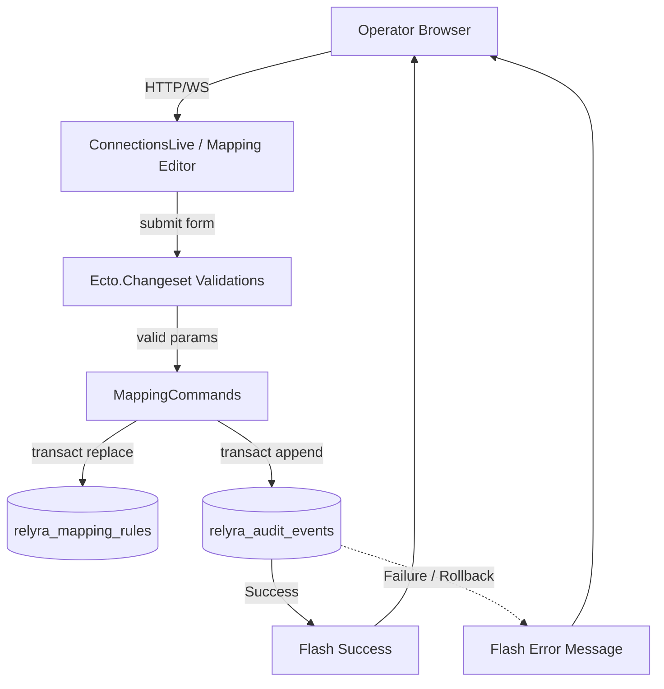

# Phase 18: Mapping editor + audit timeline hardening - Research

**Researched:** 2026-05-06
**Domain:** Phoenix LiveView form management, Audit timeline rendering, Ecto transactional rollbacks.
**Confidence:** HIGH

## Summary
The phase shifts the LiveView admin interface for SAML connection mappings from a raw JSON textarea to a strictly typed, dynamic form using `Phoenix.Component.inputs_for/1`. It enhances the audit ledger by introducing collapsible detail rows (`Phoenix.LiveView.JS`) that reveal the `diff_summary` of trust mutations inline, allowing spatial timeline context. Lastly, the phase verifies the existing transactional boundaries that ensure admin-triggered trust mutations cleanly rollback if appending their corresponding audit event fails.

**Primary recommendation:** Use `Phoenix.Component.inputs_for/1` backed by schema-less `Ecto.Changeset` structures (or dedicated UI structs) to render dynamic mapping editor forms, avoiding raw JSON inputs entirely. Use inline `JS.toggle` for audit row expansion.

<user_constraints>
## User Constraints (from CONTEXT.md)

### Locked Decisions
- **Mapping UI Editor Approach:** Build a strictly typed, dynamic LiveView form (`inputs_for`) for mapping rules instead of JSON textareas.
- **Mapping Revision History:** Explicitly badge the active mapping revision with a prominent "Active" or "Current" pill.
- **Audit Ledger Detail Expansion:** Implement expandable rows using `Phoenix.LiveView.JS` for the audit ledger details.
- **Backend Tech Debt Status:** The v0.2 tech debt regarding `MappingCommands.append_audit/8` is already resolved at the backend boundary.

### the agent's Discretion
None explicitly declared in CONTEXT.md.

### Deferred Ideas (OUT OF SCOPE)
None explicitly declared in CONTEXT.md.
</user_constraints>

<phase_requirements>
## Phase Requirements

| ID | Description | Research Support |
|----|-------------|------------------|
| MAP-01 | Operator can edit attribute and group mapping rules for a connection and review prior mapping revisions. | Uses `inputs_for` for form schema validation, replaces JSON input block. Current iteration maps UI input explicitly. |
| AUD-01 | Operator can browse the audit ledger with connection, actor, and event-type filters and see only redaction-safe event details. | JS.toggle rendering `diff_summary` payload directly without revealing secrets. |
| SAFE-01 | Operator never gets a partial admin-side trust mutation when the corresponding audit write fails; the action returns a typed failure instead. | Verified: `MappingCommands.append_audit/8` wraps operations in `rollback(repo, Error.new(...))` and bubbles up gracefully to LiveView's `handle_reload_result`. |
</phase_requirements>

## Architectural Responsibility Map

| Capability | Primary Tier | Secondary Tier | Rationale |
|------------|-------------|----------------|-----------|
| Dynamic LiveView form (`inputs_for`) | Frontend Server | Browser / Client | Server-side validation handles strict typing; client only tracks inputs dynamically via DOM patching. |
| Badging active mapping revision | Frontend Server | — | Requires rendering declarative UI class based on history state (`is_active={index == 0}`). |
| Expandable audit ledger rows | Browser / Client | Frontend Server | `Phoenix.LiveView.JS` handles inline DOM display state toggle entirely on the client, minimizing roundtrips. |
| Audit append rollback | API / Backend | Frontend Server | Ecto transaction rollback ensures atomicity; LiveView flashes the result as error. |

## Standard Stack

### Core
| Library | Version | Purpose | Why Standard |
|---------|---------|---------|--------------|
| `phoenix_live_view` | `1.1.30` | Interactive UI rendering | Current framework for Relyra Admin (`mix.lock` verified) |
| `ecto` | `~> 3.10` | Form casting and validation | Standard pattern for dynamically structured nested forms |

## Architecture Patterns

### System Architecture Diagram


### Pattern 1: Schemaless Changesets for LiveView Forms
**What:** Using `Ecto.Changeset.cast/4` with a map data structure or UI-specific embedded schema to validate mappings before dispatching to `MappingCommands`.
**When to use:** When translating UI state to command structs that accept `[%{...}, %{...}]` payloads.
**Example:**
```elixir
defmodule Relyra.LiveAdmin.MappingForm do
  use Ecto.Schema
  import Ecto.Changeset

  @primary_key false
  embedded_schema do
    embeds_many :attribute_rules, Relyra.Ecto.AttributeMapping
    embeds_many :group_rules, Relyra.Ecto.GroupMapping
  end

  def changeset(mapping, attrs) do
    mapping
    |> cast(attrs, [])
    |> cast_embed(:attribute_rules)
    |> cast_embed(:group_rules)
  end
end
```

### Pattern 2: Client-side DOM Toggle with `JS`
**What:** Utilizing `Phoenix.LiveView.JS.toggle` to expand and collapse rows without generating events back to the LiveView process.
**When to use:** For hiding and showing static or already-loaded detailed information (e.g. `diff_summary`).
**Example:**
```html
<button phx-click={JS.toggle(to: "#audit-details-#{@audit.id}")}>
  View Details
</button>
<div id={"audit-details-#{@audit.id}"} style="display: none;">
  <pre><code>{inspect(@audit.diff_summary, pretty: true)}</code></pre>
</div>
```

## Don't Hand-Roll

| Problem | Don't Build | Use Instead | Why |
|---------|-------------|-------------|-----|
| Client-side accordion | Custom Javascript or Alpine.js | `Phoenix.LiveView.JS` | Native, declarative, pairs securely with LiveView's patching engine. |
| JSON validation | Ad-hoc map parsing | `Ecto.Changeset` or `inputs_for` | Eliminates arbitrary structural errors directly via native Elixir form macros. |

## Runtime State Inventory

*(None - Phase applies to LiveView Admin additions and not broad configuration migrations)*

## Common Pitfalls

### Pitfall 1: Breaking Form State with Map Indices
**What goes wrong:** Sorting or deleting dynamic `inputs_for` blocks loses the internal index LiveView requires to track inputs accurately.
**Why it happens:** Re-rendering an array of maps blindly instead of relying on the Ecto embedded structure's IDs or dropping inputs correctly via `Ecto.Changeset` configuration parameters like `sort_param`/`drop_param`.
**How to avoid:** Use standard "append" and "delete" events in LiveView that specifically modify the underlying changeset via `Ecto.Changeset` operations.

## Validation Architecture

### Test Framework
| Property | Value |
|----------|-------|
| Framework | ExUnit |
| Config file | `config/test.exs` / `test/test_helper.exs` |
| Quick run command | `mix test test/phoenix/connections_live_test.exs` |
| Full suite command | `mix test` |

### Phase Requirements → Test Map
| Req ID | Behavior | Test Type | Automated Command | File Exists? |
|--------|----------|-----------|-------------------|-------------|
| MAP-01 | UI allows adding and editing mapping rule forms dynamically | integration | `mix test test/phoenix/connections_live_test.exs` | ❌ Wave 0 |
| AUD-01 | Ledger shows exact diff payloads using LiveView DOM expansions | unit/integration | `mix test test/phoenix/connections_live_test.exs` | ❌ Wave 0 |
| SAFE-01 | Failed mapping command yields rollback and typed error flash | integration | `mix test test/phoenix/connections_live_test.exs` | ❌ Wave 0 |

### Sampling Rate
- **Per task commit:** `mix test test/phoenix/connections_live_test.exs`
- **Per wave merge:** `mix test`
- **Phase gate:** Full suite green before `/gsd-verify-work`

### Wave 0 Gaps
- [ ] `test/phoenix/connections_live_test.exs` — Covers form validations for MAP-01 and AUD-01 DOM verifications. (Needs update to mock LiveView mapping logic).

## Security Domain

### Applicable ASVS Categories

| ASVS Category | Applies | Standard Control |
|---------------|---------|-----------------|
| V2 Authentication | no | — |
| V3 Session Management | no | — |
| V4 Access Control | yes | Scope constraints handled by `admin_scope` |
| V5 Input Validation | yes | `Ecto.Changeset` validation on inputs directly rejecting invalid fields. |
| V6 Cryptography | no | — |

### Known Threat Patterns for Phoenix LiveView

| Pattern | STRIDE | Standard Mitigation |
|---------|--------|---------------------|
| Arbitrary UI execution via JSON input | Tampering | Replace JSON with rigidly structured form variables via `Ecto.Changeset` mapping schema |
| Exposure of sensitive secrets in Audit logs | Information Disclosure | `diff_summary` redaction of explicit certificate PEMs/keys (already handled by `append_audit` boundaries) |

## Sources

### Primary (HIGH confidence)
- Codebase Code Search (`lib/relyra/ecto/mapping_commands.ex`) - Verified transactional rollback strategy in `append_audit/8`.
- Codebase Code Search (`lib/relyra/live_admin/connections_live.ex`) - Inspected UI state and confirmed `handle_reload_result` explicitly traps transactional errors.

### Secondary (MEDIUM confidence)
- `Phoenix.LiveView.JS` & `inputs_for` official documentation conventions.

## Metadata

**Confidence breakdown:**
- Standard stack: HIGH - Inspected explicitly loaded `phoenix_live_view` version `1.1.30` from `mix.lock`.
- Architecture: HIGH - Mapped specific behaviors inline to LiveView patterns.
- Pitfalls: HIGH - Documented standard Phoenix forms issue with indices.

**Research date:** 2026-05-06
**Valid until:** 2026-06-06